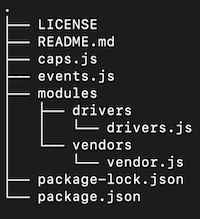

# **caps**

Author: Jessi Velazquez

Deployed Link: N/A

Pull Request: [https://github.com/JessiVelazquez/caps/pull/2](https://github.com/JessiVelazquez/caps/pull/2)

Testing: N/A

## **Overview and Description**

This is an application that uses Node.js's built in event emitter functionality to log event for customer orders, driver pick ups, and deliveries, using fake data from Node package Faker, and logs them to the console at set time intervals.

## **Setup**

Clone the repository from the following link, and then follow the steps below: [https://github.com/JessiVelazquez/caps](https://github.com/JessiVelazquez/caps)

## **.env Requirements**

To run the application, you must create a .env file at the root level, with the following environmental variables included:

```
STORE=FlowerStore
```

## **Dependencies**

- Faker
- dotenv

Before attempting to run the application locally, it is vital to install the required dependencies. Do so by running the following command in the terminal from the root level:

```
node i
```

## **Run the Application**

To run the application, run the following command in the terminal at the root level:

```
node caps.js
```

# **Architecture**



## **UML**


